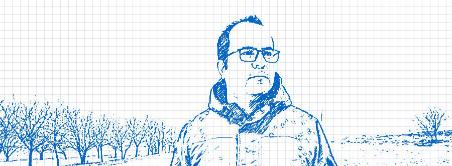

+++
date = "2015-08-22T06:42:21-07:00"
draft = false
title = "درباره"

+++

 سید جواد سجادی، متولد و ساکن شهرستان [سقز](https://fa.wikipedia.org/wiki/%D8%B3%D9%82%D8%B2) در استان کردستان.از سال ١٣٨٣ بصورت آزادکار(freelancer) مشغول تولید محتوا، ترجمه و طراحی در زمینه آیتی به زبان کردی بودم.در مقطع کارشانسی ارشد رشته جزا و جرم شناسی فارغ التحصیل شدم.
تفاوت رشته آیتی با حقوق به نظر بنده، پویا و منعطف بودن آن است؛ به روز بودن، تکاپو و حس تازگی در فلسفەی آیتی وجود دارد که آن را در رشته حقوق نیافتم.

**فعالیت‌ها**

[کتابهای نوشته شده ](book/) 
[ترجمه‌های نرم‌افزارها](software/) 
[سایت‌های طراحی شده ](website/)

**نگارخانه**


